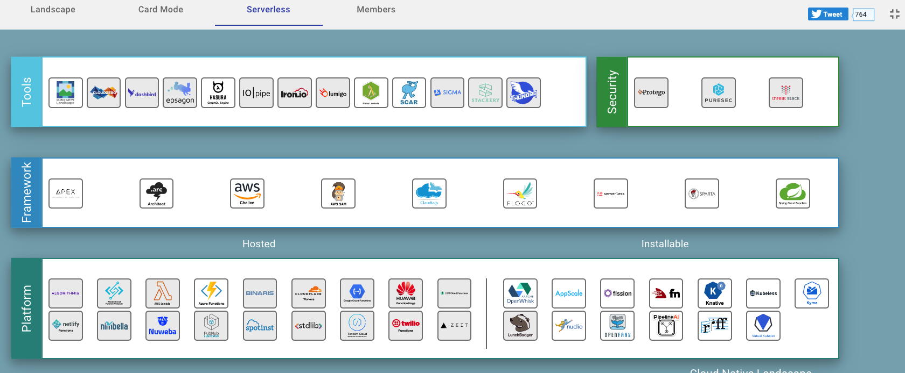

## LearnServerless
### Learnserverless [All Courseware to learn and demonstrate Serverless]

### Topics will be explained on All Serverless Tools and Build Simple Applications using it. 

## Installable

1. Virtual Kubelet
2. Kubeless
3. Knative
4. OpenWhisk
5. Fission
6. Fn
7. Kyma
8. lunchbadger
9. nuclio
10. openfass
11. pipeline AI
12. rff
13. Molecule
14. Podman
